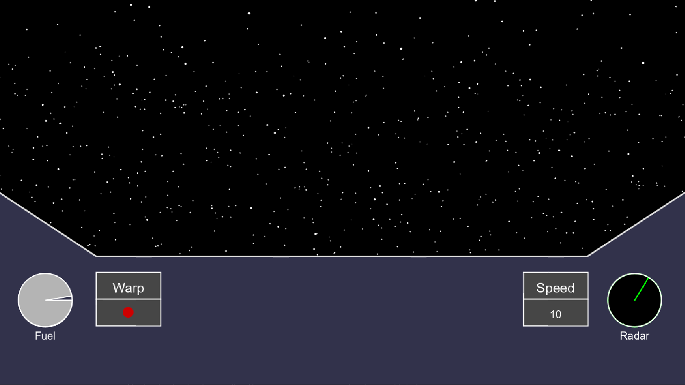
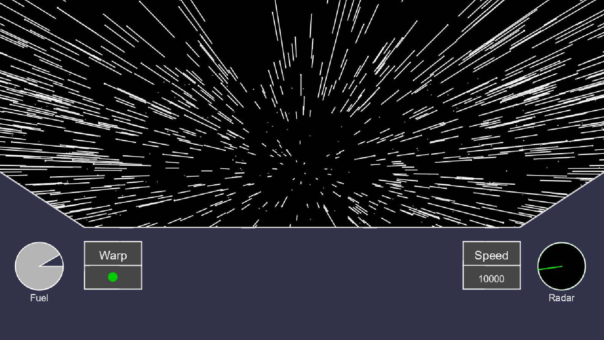
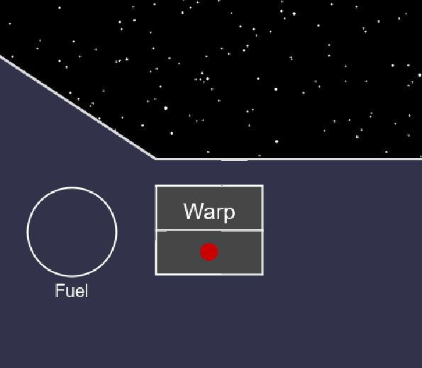

# SciFi UI Project

Name: Fionn MacNamara

Student Number: C16753791


# Description of the assignment

For my assignment, I decided to create a ship travelling through space, with the option to control the speed of the ship and see the stars and fuel levels move accordingly. 

# Instructions

Press the 'Up' arrow key to increase speeds, and the 'Down' arrow key to return to normal speed.
The 'G' key can be used to go to Warp speed.
The ship will continue to move as long as there is fuel, with faster speeds consuming fuel at a greater rate.

# How it works

##Files

- Button
This is an object that takes X/Y coordinates and a String, and draws a button on the screen at the location. Its render() method is called in the draw() method in the UI file.

- Console
The Console class is used to draw the dashboard of the ship onscreen. It takes the size height and width as parameters. It uses lines, rectangles, and triangles in a render() method, which is called from draw() in UI.

- Fuel
The Fuel class is used to display the current fuel levels of the ship. The fuel level is kept in a variable called 'max', which is declared in UI. The fuel decreases at a rate depending on the current speed of the ship.

```Java
public void render()
{
	ui.fill(180);
	ui.stroke(255);
	ui.arc(x, y, 100, 100, ui.radians(0), ui.radians(ui.max), ui.PIE);
}

public void update()
{
	ui.max -= ui.fuelConsumption;
}
```

- Indicator
The Indicator class uses inheritance and extends from the Button class. It makes use of Button to give it shape, and adds on a new parameter, 'state', that is used with the variable 'light' to control the light showing whether the ship is at warp speed or not. 
When the ship is at warp, the light turns green. It shows red when not at warp.

```Java
public class Indicator extends Button
{
    private int light = 0;

    public Indicator(UI ui, float x, float y, float width, float height, String text, int state)
    {
        super(ui, x, y, width, height, text);
        light = state;
    }

    //Used to set the value for light
    public void setState(int newState)
    {
        light = newState;
    }

    public void update()
    {
        ui.noStroke();
        if(light == 0) {
            ui.fill(205, 0, 0);
        }

        //If the light varible is set to 1 and the 'max' (remainging fuel) variable
        //is greater than 2, the indicator will show green, otherwise remain red 
        if(light == 1) {
            if(ui.max < 1f) {
                ui.fill(205, 0, 0);
            }
            else {
                ui.fill(0, 205, 0);
            }
        }
        ui.ellipse((ui.width / 7) + 60, ((ui.height / 7) * 5) + 75, 20, 20);
    }
 }
```

- Radar
A simple radar displayed on the right side of the console.

- Reading
The Reading class also extends the Button class through inheritance. It is modified to show a dynamic reading of the current speed of the ship. In the program, the Reading class is used to show the current speed of the ship. It is updated from the UI class, and changed from within if statements in the keyPressed() method.

```Java
public class Reading extends Button
{
    private String value = "10";

    public Reading(UI ui, float x, float y, float width, float height, String text, String value)
    {
        super(ui, x, y, width, height, text);
        value = "10";
    }

    public void setState(String newState)
    {
        value = newState;
    }

    public void update()
    {
        ui.stroke(255);
        ui.strokeWeight(2);
        ui.textAlign(PApplet.CENTER, PApplet.CENTER);
        ui.textSize(20);
        //Checks the value of max (fuel level) is greater than 1 and
        //displays the appropriate speed value on the dashboard
        if(ui.max > 1f) {
            if(value == "10") {
                ui.text(value, (ui.width-(ui.width / 7)) - 60, ((ui.height / 7) * 5) + 75);
            }
            if(value == "100") {
                ui.text(value, (ui.width-(ui.width / 7)) - 60, ((ui.height / 7) * 5) + 75);
            }
            if(value == "10000") {
                ui.text(value, (ui.width-(ui.width / 7)) - 60, ((ui.height / 7) * 5) + 75);;
            }
        }
        //This code executes when max drops below 1
        else {
            ui.text("0", (ui.width-(ui.width / 7)) - 60, ((ui.height / 7) * 5) + 75);
        }
    }
 }
```

- Star
The Star class is used to draw the stars on the screen. It takes the screen height and width as parameters, and the array is populated during setup() in the UI class with stars that are generated at random locations.

```Java
    public void setup()
    {
        //Initialises all the stars
        for (int i = 0; i < stars.length; i++) {
            stars[i] = new Star(this, width, height);
        }
    }
```

In the update() method in Star, the speed of the movement of the stars is controlled, and the stars are created again when they move off the screen. There is also an if loop that checks the fuel levels are greater than 1. If they are lower, the stars stop moving.

```Java
    public Star(UI ui, float width, float height) {
        this.ui = ui;
        this.width = width;
        this.height = height;
        x = ui.random(-width / 2, width / 2);
        y = ui.random(-height /2, height / 2);
        z = ui.random(width / 2);
        pz = z;
    }

    public void update() {
        if (ui.max > 1) {
            z -= ui.speed;
            if(z < 1) {
                z = width / 2;
                x = ui.random(-width/2, width/2);
                y = ui.random(-height/2, height/2);
                pz = z;
            }
        }
    }
```

In the render() method, the map function is used to generate a number between 0 and 1 taken from the x, y, and z values, and an ellipse is also drawn based on these values. A line is also drawn using these mapped values. 

```Java
public void render() {
        ui.fill(255);
        ui.noStroke();
        float sx = ui.map(x / z, 0, 1, 0, width/2);
        float sy = ui.map(y / z, 0, 1 , 0 , height/2);
        float r = ui.map(z, 0, width/2, 5, 0);
        ui.ellipse(sx, sy, r, r);
        
        float px = ui.map(x / pz, 0, 1, 0, width/2);
        float py = ui.map(y / pz, 0, 1, 0, height/2);
        pz = z;
        ui.stroke(255);
        ui.line(px, py, sx, sy);
}
```

- UI
The UI class is the most important class in the project, with the settings(), setup(), and draw() methods, as well as keyPressed(). 

```Java
    public void keyPressed()
    {
        keys[keyCode] = true;

        if(key == CODED) {
            //Increases speed and updates value when the 'Up' key is pressed
            if(keyCode == UP) {
                speed = 10f;
                indicatorWarp.setState(0);
                speedValue.setValue("100");
                fuelConsumption = 0.2f;
            }
            
            //Resets speed and updates value when the 'Down' key is pressed
            else if(keyCode == DOWN) {
                speed = 0.3f;
                indicatorWarp.setState(0);
                speedValue.setValue("10");
                fuelConsumption = 0.05f;
            }
        }
        //When 'g' is pressed, speed is set to 60 and the value is updated
        else if(key == 'g' || key == 'G') {
            speed = 60f;
            indicatorWarp.setState(1);
            speedValue.setValue("10000");
            fuelConsumption = 0.6f;
        }
    }
```

Some object created in the setup() method:

```Java
        buttonWarp = new Button(this, width / 7, (height / 7) * 5, 120, 50, "Warp");
        indicatorWarp = new Indicator(this, width / 7, ((height / 7) * 5) + 50, 120, 50, "", 0);

        //Creates a Button and Reading object
        buttonSpeed = new Button(this, (width-(width / 7)) - 120, (height / 7) * 5, 120, 50, "Speed");
        speedValue = new Reading(this, (width-(width / 7)) - 120, ((height / 7) * 5) + 50, 120, 50, "", value);

        //Creates a Fuel object
        fuel = new Fuel(this, (width / 7) - 95, ((height / 3) * 2) + 82);

        radar = new Radar(this, 0.75f, width - 95, ((height / 3) * 2) + 82, 50);

        //Creates the Console object
        console = new Console(this, width, height);
```

Use of pushMatrix and popMatrix():

```Java
        pushMatrix();
        translate(width/2, height/2);
        for (int i = 0; i < stars.length; i++) {
            stars[i].update();
            stars[i].render();
        }
        popMatrix();
```

##Screenshots



A view of the main screen showing the console and the ship in it's slowest speed.



A view of the ship at warp speed, showing the Warp indicator light turned green, and the movement of the stars.



When the ship runs out of fuel, the fuel gauge shows empty and the movement of the stars stops.

Youtube video:

[](https://www.youtube.com/watch?v=kQlr85s1AZI)


| Feature | Impletmented? |
|-----------|-----------|
|Variables, loops, methods | ✔️ |
|Arrays & array lists | ✔️ |
|Objects, inheritance | ✔️ |
|pushMatrix, popMatrix, translate | ✔️ |

